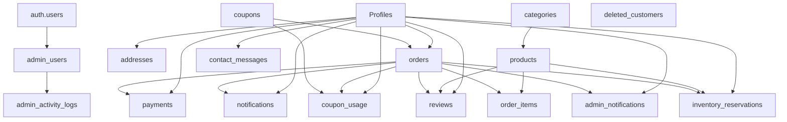

# ANNAPURNA — Supabase Database Schema Reference

> **Purpose:** Single source of truth for all backend and frontend development.
> **Last Updated:** 2026-09-11
> **Schema:** `public`

> [!CAUTION]
> Do NOT modify the database schema without explicit approval.
> Do NOT rename columns, drop tables, or alter foreign keys automatically.
> If a schema change is needed, STOP and explain it before making it.

---

## Table of Contents

1. [Profiles](#1-profiles)
2. [addresses](#2-addresses)
3. [admin_activity_logs](#3-admin_activity_logs)
4. [admin_notifications](#4-admin_notifications)
5. [admin_users](#5-admin_users)
6. [categories](#6-categories)
7. [contact_messages](#7-contact_messages)
8. [coupon_usage](#8-coupon_usage)
9. [coupons](#9-coupons)
10. [deleted_customers](#10-deleted_customers)
11. [inventory_reservations](#11-inventory_reservations)
12. [notifications](#12-notifications)
13. [order_items](#13-order_items)
14. [orders](#14-orders)
15. [payments](#15-payments)
16. [products](#16-products)
17. [reviews](#17-reviews)
18. [Relationship Map](#relationship-map)
19. [Business Data Flow](#business-data-flow)
20. [Development Rules](#development-rules)

---

## 1. Profiles

> Customer/user profile data. Linked to `auth.users` via the `id` UUID.

| Column                       | Notes                        |
|------------------------------|------------------------------|
| `id`                         | UUID (PK), matches auth.users.id |
| `full_name`                  |                              |
| `email`                      |                              |
| `phone`                      |                              |
| `avatar_url`                 |                              |
| `role`                       |                              |
| `Status`                     | ⚠️ Capital 'S' in DB         |
| `created_at`                 |                              |
| `Updated_at`                 | ⚠️ Capital 'U' in DB         |
| `date_of_birth`              | Nullable, no CHECK constraint |
| `preferred_language`         | Nullable                    |
| `custom_language`            | Nullable, used when `preferred_language` = 'Others' |
| `dietary_preference`         | Nullable                    |
| `food_allergies`             | Nullable                    |
| `spice_preference`           | Nullable                    |
| `promotional_offers`         | boolean, NOT NULL, DEFAULT true |
| `new_product_notifications`  | boolean, NOT NULL, DEFAULT true |
| `email_notifications`        | boolean, NOT NULL, DEFAULT true |
| `sms_notifications`          | boolean, NOT NULL, DEFAULT false |
| `whatsapp_notifications`     | boolean, NOT NULL, DEFAULT false |

**Referenced by:**

- `addresses.customer_id`
- `orders.customer_id`
- `payments.customer_id`
- `coupon_usage.customer_id`
- `reviews.customer_id`
- `notifications.customer_id`
- `contact_messages.customer_id`
- `admin_notifications.customer_id`
- `inventory_reservations.customer_id`

---

## 2. addresses

| Column          | Notes              |
|-----------------|--------------------|
| `id`            | PK                 |
| `customer_id`   | FK → Profiles.id   |
| `label`         |                    |
| `full_name`     |                    |
| `phone`         |                    |
| `address_line_1`|                    |
| `address_line_2`|                    |
| `city`          |                    |
| `state`         |                    |
| `postal_code`   |                    |
| `is_default`    |                    |
| `created_at`    |                    |
| `updated_at`    |                    |

**Foreign Key:**

```
addresses.customer_id → Profiles.id
ON DELETE: CASCADE
```

---

## 3. admin_activity_logs

| Column        | Notes                        |
|---------------|------------------------------|
| `id`          | PK                           |
| `admin_id`    | FK → admin_users.id (NOT Profiles.id) |
| `action`      |                              |
| `entity_type` |                              |
| `entity_id`   |                              |
| `description` |                              |
| `metadata`    |                              |
| `created_at`  |                              |

**Foreign Key:**

```
admin_activity_logs.admin_id → admin_users.id
ON UPDATE: CASCADE
ON DELETE: NO ACTION
```

> [!IMPORTANT]
> `admin_id` references `admin_users.id`, NOT `Profiles.id`.

---

## 4. admin_notifications

| Column        | Notes                          |
|---------------|---------------------------------|
| `id`          | PK                              |
| `type`        |                                 |
| `title`       |                                 |
| `message`     |                                 |
| `order_id`    | FK → orders.id (nullable)       |
| `customer_id` | FK → Profiles.id (nullable)     |
| `is_read`     |                                 |
| `created_at`  |                                 |

**Foreign Keys:**

```
admin_notifications.order_id    → orders.id
admin_notifications.customer_id → Profiles.id
```

> [!NOTE]
> These are internal notifications surfaced to admins (e.g. new order, new
> contact message), distinct from `notifications`, which targets customers.

---

## 5. admin_users

| Column       | Notes                          |
|--------------|--------------------------------|
| `id`         | PK                             |
| `user_id`    | FK → auth.users.id             |
| `is_active`  | Controls admin authorization   |
| `created_at` |                                |

**Foreign Key:**

```
admin_users.user_id → auth.users.id
ON UPDATE: CASCADE
ON DELETE: CASCADE
```

**Database Function:** `public.is_admin()` checks whether the authenticated user has an active record (`is_active = true`) in this table.

> [!WARNING]
> Do NOT store admin passwords in this table.
> Authentication is handled entirely by Supabase Auth (`auth.users`).

---

## 6. categories

| Column       | Notes              |
|--------------|--------------------|
| `id`         | PK                 |
| `name`       |                    |
| `slug`       |                    |
| `description`|                    |
| `image_url`  |                    |
| `is_active`  |                    |
| `created_at` |                    |
| `updated_at` |                    |

**Referenced by:**

- `products.category_id`

---

## 7. contact_messages

| Column        | Notes                      |
|---------------|----------------------------|
| `id`          | PK                         |
| `customer_id` | FK → Profiles.id (nullable)|
| `name`        |                            |
| `email`       |                            |
| `phone`       |                            |
| `subject`     |                            |
| `message`     |                            |
| `status`      |                            |
| `admin_notes` |                            |
| `created_at`  |                            |
| `updated_at`  |                            |

**Foreign Key:**

```
contact_messages.customer_id → Profiles.id
ON DELETE: SET NULL
```

---

## 8. coupon_usage

| Column           | Notes              |
|------------------|--------------------|
| `id`             | PK                 |
| `coupon_id`      | FK → coupons.id    |
| `customer_id`    | FK → Profiles.id   |
| `order_id`       | FK → orders.id     |
| `discount_amount`|                    |
| `used_at`        |                    |

**Foreign Keys:**

```
coupon_usage.coupon_id   → coupons.id
coupon_usage.customer_id → Profiles.id
coupon_usage.order_id    → orders.id
```

---

## 9. coupons

| Column                 | Notes        |
|------------------------|--------------|
| `id`                   | PK           |
| `code`                 |              |
| `description`          |              |
| `discount_type`        |              |
| `discount_value`       |              |
| `minimum_order_amount` |              |
| `maximum_discount`     |              |
| `usage_limit`          |              |
| `used_count`           |              |
| `starts_at`            |              |
| `expires_at`           |              |
| `is_active`            |              |
| `created_at`           |              |
| `updated_at`           |              |

**Referenced by:**

- `orders.coupon_id`
- `coupon_usage.coupon_id`

---

## 10. deleted_customers

| Column         | Notes                                    |
|----------------|-------------------------------------------|
| `id`           | PK                                        |
| `full_name`    |                                            |
| `email`        |                                            |
| `phone`        |                                            |
| `role`         |                                            |
| `status`       |                                            |
| `registered_at`|                                            |
| `deleted_at`   |                                            |

> [!NOTE]
> Archival/audit table only — an immutable snapshot of a `Profiles` row taken
> at deletion time. It has no live foreign key back to `Profiles` (the source
> row no longer exists) and nothing references it.

---

## 11. inventory_reservations

| Column        | Notes                                       |
|---------------|----------------------------------------------|
| `id`          | PK                                            |
| `session_id`  | Guest/cart session identifier                 |
| `order_id`    | FK → orders.id (nullable)                     |
| `customer_id` | FK → Profiles.id (nullable)                   |
| `product_id`  | FK → products.id                              |
| `quantity`    |                                                |
| `status`      |                                                |
| `expires_at`  |                                                |
| `created_at`  |                                                |
| `updated_at`  |                                                |

**Foreign Keys:**

```
inventory_reservations.order_id    → orders.id
inventory_reservations.customer_id → Profiles.id
inventory_reservations.product_id  → products.id
```

> [!NOTE]
> Holds stock temporarily against a `session_id` (guest cart) or `order_id`
> (checkout in progress) while `status` is active, and expires via
> `expires_at` if the order/session is never completed. `customer_id` and
> `order_id` are nullable to support anonymous/guest reservations that
> precede order creation.

---

## 12. notifications

| Column        | Notes              |
|---------------|--------------------|
| `id`          | PK                 |
| `customer_id` | FK → Profiles.id   |
| `order_id`    | FK → orders.id     |
| `type`        |                    |
| `title`       |                    |
| `message`     |                    |
| `is_read`     |                    |
| `created_at`  |                    |

**Foreign Keys:**

```
notifications.customer_id → Profiles.id
notifications.order_id    → orders.id
```

---

## 13. order_items

| Column          | Notes                              |
|-----------------|------------------------------------|
| `id`            | PK                                 |
| `order_id`      | FK → orders.id                     |
| `product_id`    | FK → products.id                   |
| `product_name`  | ⚠️ Purchase-time snapshot           |
| `product_price` | ⚠️ Purchase-time snapshot           |
| `quantity`       |                                    |
| `subtotal`      |                                    |
| `created_at`    |                                    |

**Foreign Keys:**

```
order_items.order_id   → orders.id
order_items.product_id → products.id
```

> [!IMPORTANT]
> `product_name` and `product_price` are stored as purchase-time snapshots.
> Do NOT replace historical values with the current `products.price` or `products.name`.

---

## 14. orders

| Column             | Notes                               |
|--------------------|-------------------------------------|
| `id`               | PK                                  |
| `category_id`      | ⚠️ Exists in table — do not remove  |
| `customer_id`      | FK → Profiles.id                    |
| `subtotal`         |                                     |
| `discount_amount`  |                                     |
| `shipping_amount`  |                                     |
| `tax_amount`       |                                     |
| `total_amount`     |                                     |
| `coupon_id`        | FK → coupons.id                     |
| `payment_status`   |                                     |
| `order_status`     |                                     |
| `shipping_address` | Exact DB spelling (verified live)   |
| `notes`            | ⚠️ NOT NULL — must insert `''` not `null`. **Must NOT be UNIQUE** |
| `created_at`       |                                     |
| `updated_at`       |                                     |

**Foreign Keys:**

```
orders.customer_id → Profiles.id
orders.coupon_id   → coupons.id
```

> [!NOTE]
> The orders shipping column is `shipping_address` (with trailing 's').
> This was verified directly against the live database schema.

> [!NOTE]
> `notes` has a NOT NULL constraint — inserting `null` fails with Postgres
> 23502. Always insert an empty string `''` when no notes are provided.
> Verified directly against the live database schema.

> [!IMPORTANT]
> `notes` must **NOT** be UNIQUE. Checkout does not require notes, so many
> orders legitimately share `notes = ''` (or any repeated value), and a single
> customer may place multiple orders. An incorrect UNIQUE constraint/index on
> `notes` caused subsequent blank-notes orders to fail with Postgres 23505
> (unique_violation). Removed by migration
> `admin/20260911120000_drop_orders_notes_unique.sql`. Do not re-add any
> uniqueness on `notes` (nor on `customer_id` / `coupon_id` / email).

> [!NOTE]
> `category_id` currently exists in the table structure.
> Its usage/relationship will be reviewed separately before backend implementation.

---

## 15. payments

| Column            | Notes              |
|-------------------|--------------------|
| `id`              | PK                 |
| `order_id`        | FK → orders.id     |
| `customer_id`     | FK → Profiles.id   |
| `payment_provider`|                    |
| `transaction_id`  | ⚠️ NOT NULL — COD has no real txn, use a placeholder |
| `amount`          |                    |
| `currency`        |                    |
| `payment_status`  |                    |
| `payment_method`  |                    |
| `paid_at`         |                    |
| `created_at`      |                    |
| `updated_at`      |                    |

**Foreign Keys:**

```
payments.order_id    → orders.id
payments.customer_id → Profiles.id
```

---

## 16. products

| Column              | Notes              |
|---------------------|--------------------|
| `id`                | PK                 |
| `category_id`       | FK → categories.id |
| `name`              |                    |
| `slug`              |                    |
| `description`       |                    |
| `short_description` | Exact DB name      |
| `price`             |                    |
| `compare_at_price`  | Exact DB name      |
| `weight`            |                    |
| `servings`          |                    |
| `image_url`         |                    |
| `images`            |                    |
| `sku`               |                    |
| `stock_quantity`     |                    |
| `is_active`         |                    |
| `is_featured`       |                    |
| `is_bestseller`     |                    |
| `created_at`        |                    |
| `updated_at`        |                    |

**Foreign Key:**

```
products.category_id → categories.id
```

**Referenced by:**

- `order_items.product_id`
- `reviews.product_id`
- `inventory_reservations.product_id`

---

## 17. reviews

| Column        | Notes              |
|---------------|--------------------|
| `id`          | PK                 |
| `customer_id` | FK → Profiles.id   |
| `product_id`  | FK → products.id   |
| `order_id`    | FK → orders.id     |
| `rating`      |                    |
| `review_text`  |                    |
| `is_verified`  |                    |
| `is_approved`  |                    |
| `created_at`  |                    |
| `updated_at`  |                    |

**Foreign Keys:**

```
reviews.customer_id → Profiles.id
reviews.product_id  → products.id
reviews.order_id    → orders.id
```

---

## Relationship Map



> [!NOTE]
> `deleted_customers` is a standalone archival snapshot table — it has no
> live foreign-key relationships (see [deleted_customers](#10-deleted_customers)).

**Text representation:**

```
Profiles
├── addresses.customer_id
├── orders.customer_id
├── payments.customer_id
├── coupon_usage.customer_id
├── reviews.customer_id
├── notifications.customer_id
├── contact_messages.customer_id
├── admin_notifications.customer_id
└── inventory_reservations.customer_id

categories
└── products.category_id

products
├── order_items.product_id
├── reviews.product_id
└── inventory_reservations.product_id

orders
├── order_items.order_id
├── payments.order_id
├── coupon_usage.order_id
├── reviews.order_id
├── notifications.order_id
├── admin_notifications.order_id
└── inventory_reservations.order_id

coupons
├── orders.coupon_id
└── coupon_usage.coupon_id

admin_users
├── admin_activity_logs.admin_id
└── user_id → auth.users.id

deleted_customers
└── (standalone archive table; no live FK relationships)
```

---

## Business Data Flow

### Products
```
categories → products → customer website
```

### Ordering
```
Profiles → addresses → orders → order_items → products
```

### Payments
```
orders → payments
```

### Coupons
```
coupons → orders → coupon_usage
```

### Reviews
```
Profiles → reviews → products → orders
```

### Admin
```
auth.users → admin_users → admin_activity_logs
orders/contact_messages → admin_notifications → admin dashboard
```

### Inventory
```
products → inventory_reservations → orders
```

### Customer Deletion Archive
```
Profiles (on delete) → deleted_customers (immutable snapshot)
```

---

## Development Rules

> [!CAUTION]
> These rules apply to ALL future backend and frontend development.

1. **Use existing table names** exactly as documented above.
2. **Use existing column names** exactly — note case sensitivity (`Status`, `Updated_at`).
3. **Use existing foreign-key relationships** — do not invent new ones without approval.
4. **Do not create duplicate tables** for products, orders, customers, etc.
5. **Do not create duplicate data structures** in the frontend that diverge from this schema.
6. **Do not rename existing columns** without explicit approval and a coordinated migration plan.
7. **Do not modify the database schema automatically** — always explain and get approval first.
8. **If a schema change is required**, STOP and describe the exact change, its reason, and its impact before making it.
9. **Never expose the Supabase service-role key** in any frontend code (customer or admin).
10. **Admin write operations** must be protected by proper Supabase Auth + RLS using the `is_admin()` function.
11. **Order item snapshots** (`product_name`, `product_price`) must never be overwritten with current product data.

---

*This document is the source of truth for the ANNAPURNA Supabase schema. All backend services, admin features, and customer-facing integrations must reference this file when implementing database operations.*
